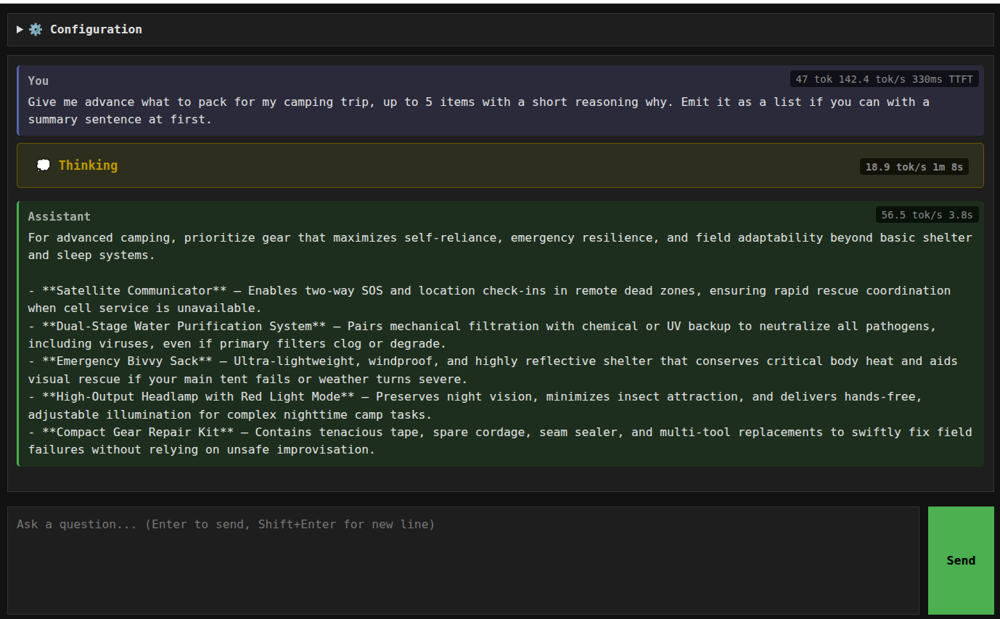

# Pebble Prompt - A Minimal LLM UI for OpenAI Compatible endpoints

A lightweight web-based interface for interacting with OpenAI-compatible LLM inference services (llama.cpp, vLLM, Ollama, LM Studio, etc.).

## Screenshot

## Features

- **Streaming responses** — real-time token-by-token output as the model generates
- **Speed indicators** — small badges on the right edge of each message area show live generation speed (tokens/sec) and elapsed time for prompt processing, thinking, and response phases
- **Collapsible thinking blocks** — reasoning/thinking output is shown in a collapsible section that starts closed by default. Toggle it open or closed during streaming and your preference is remembered for the next request. Animated dots (`.` `..` `...`) pulse on the active block header during each phase: first on your prompt while the server processes it, then on the thinking block, then on the assistant response.
- **Persistent chat history** — each exchange is appended below the previous one
- **Smart auto-scroll** — the chat area automatically scrolls to follow new content, but pauses for 5 seconds if you scroll up to read. Scrolling back to the bottom immediately resumes auto-scroll
- **Request mirroring** — the first few lines of each request are echoed into the chat for context
- **Saved configuration** — API endpoint, model, temperature, and max tokens are automatically persisted in `localStorage` so you don't have to re-enter them on each visit. The API key is encrypted at rest (AES-GCM via Web Crypto API) so it never sits in plaintext in your browser storage. You are welcome to modify the code to not store this at all if yours is sensitive.

## Quick Start

1. Place `index.html` on any static web server (or download it and open it directly in a browser) or open it from https://kulminaator.github.io/pebble-prompt/  (see notes in the end of the page).
2. Open the **⚙️ Configuration** panel and set your API URL (e.g. `http://localhost:8000/v1/chat/completions`)
3. Enter a prompt and press **Enter** or click **Send**

## Configuration

You can set these in the user interface

| Setting      | Description                          | Default                              |
|-------------|--------------------------------------|--------------------------------------|
| API URL     | Full endpoint for chat completions   | `http://localhost:8000/v1/chat/completions` |
| Model Name  | Model identifier                     | `facebook/opt-125m`                  |
| Temperature | Sampling temperature (0–2)           | `0.7`                                |
| Max Tokens  | Maximum tokens to generate           | `32768`                              |
| API Key     | Bearer token for authentication      | `not-needed`                         |

## Supported Backends

Any server implementing the [OpenAI Chat Completions API](https://platform.openai.com/docs/api-reference/chat) with streaming support:

- [llama.cpp](https://github.com/ggml-org/llama.cpp)
- [vLLM](https://docs.vllm.ai/)
- [LM Studio](https://lmstudio.ai/)
- [Ollama](https://ollama.ai/) (with OpenAI-compatible mode)
- [Text Generation Inference (TGI)](https://huggingface.co/docs/text-generation-inference/)

## Architecture

Single-page application — no build step, no dependencies. Just one `index.html` file using vanilla HTML/CSS/JavaScript with the Fetch API and Server-Sent Events (SSE) for streaming.
All the source code is right here in html page, no secret dependencies or 3GB docker files to install. Light weight, as it should be.

## CORS Note

If your inference server does not send CORS headers, you may need to enable them on the server side. For vLLM, start with `--api-key` and appropriate CORS flags, or use a reverse proxy.

## Notes

- Current version does not send history of previous requests with new requests, so every request is a fresh start. This may change in the future.
- If you open the tool from a https context but your llm is on a http context then your browser will stop you from interacting with the llm. Best workaround for this is to save the index.html locally and open it locally or serve it from a http host. This overcomes the restriction.
